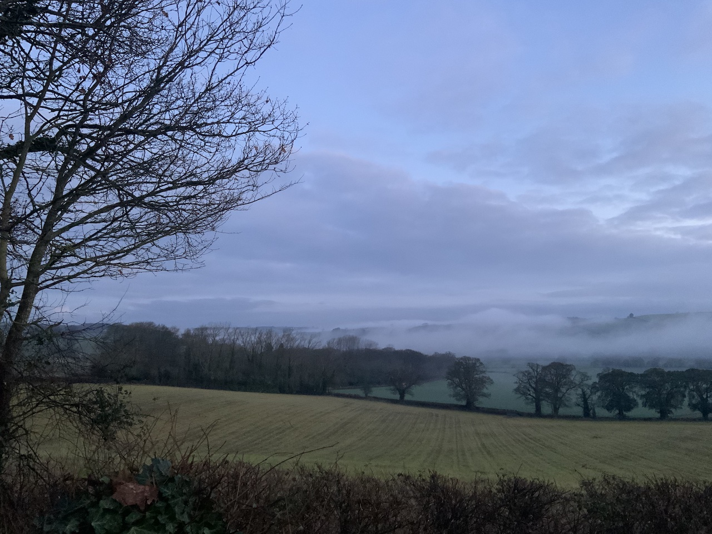

New Year, New Pretensions. 

After the best part of two decades I am finally, if not completely, setting aside my inhibitions and putting myself out there.

The primary driver is to [dogfood](https://en.wikipedia.org/wiki/Eating_your_own_dog_food) my [static cms](/projects/ssg).

A mixture of articles about my trade and whatever else floats into my head which I warn you is _a lot_, frequently _random_ and 
will _probably be largely incoherent_.

Ah, the freedom of writing when you know no-one is looking. Let’s hope that lasts until I can figure out how to craft a sentence.

I’ve always had to write to an extent; my much loved occupation for a couple of decades has been to write instructions for 
computers to carry out. But that has rules and tight expectations that this ambiguous, poorly defined  language does not. 

And sure, I’ve had to squeeze out helpful sometimes accurate documentation about said code, but there was hardly room for 
_personality_ or flowery prose there. Maybe that’s where I’ve been going wrong.

What I’m trying to excuse is that this is going to probably read as incredibly stilted and dry until I loosen my jangly 
flesh sausages. After all, you are not a computer, right? And you deserve an amount of amusement.

To date this almost immediately, I will reference the incoming 
[AI GPT writing armageddon](https://www.theguardian.com/commentisfree/2020/sep/08/robot-wrote-this-article-gpt-3) which will 
render most writings 
as redundant and _suspect_. The race is on to prove one is human. To be honest, 
I’m not completely convinced myself. So that’s another stated aim. This is basically an incredibly time consuming capture 
device pointed at myself to prove I’m not a robot. Well at least it’s more fun than 
[picking out 'crosswalks'](https://twitter.com/5tevieM/status/1356992638608678913?s=20).

Just be thankful this is not a podcast. _Yet_.

